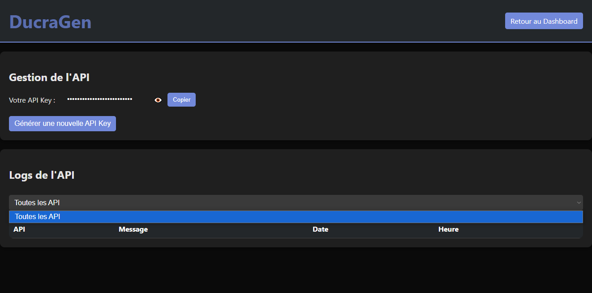
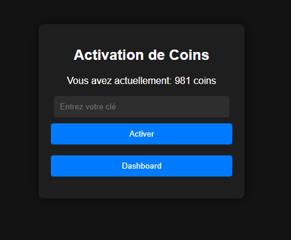
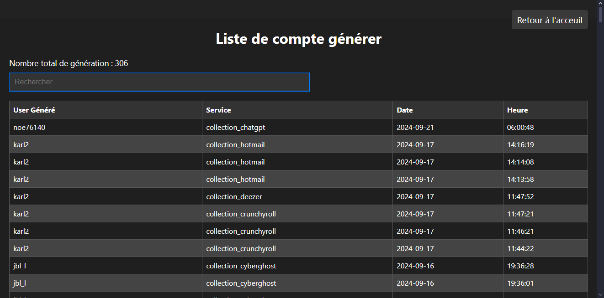
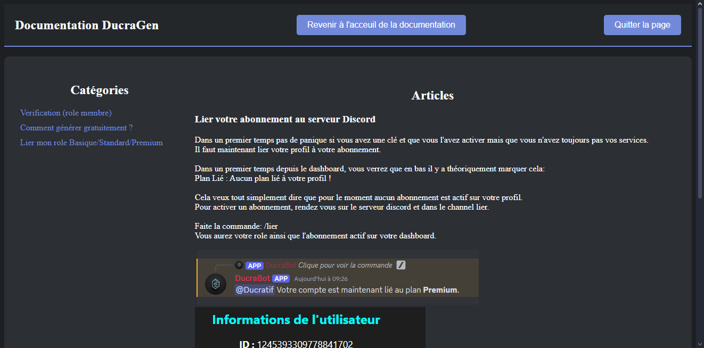
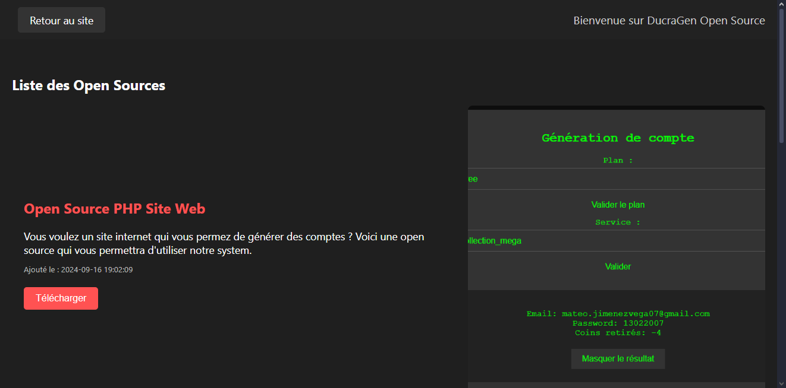
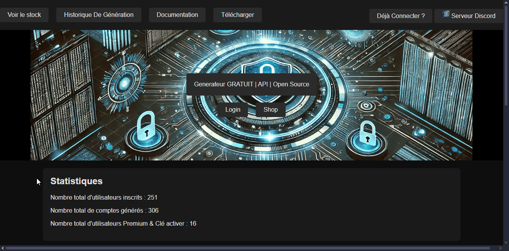
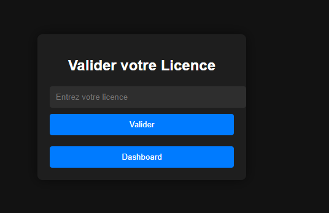
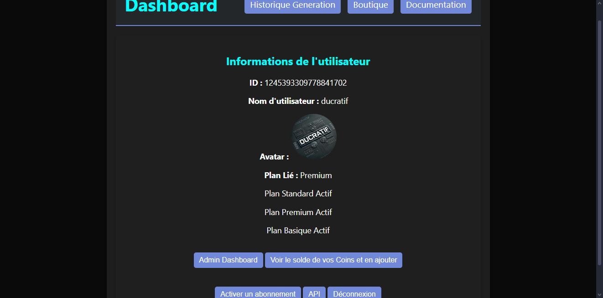
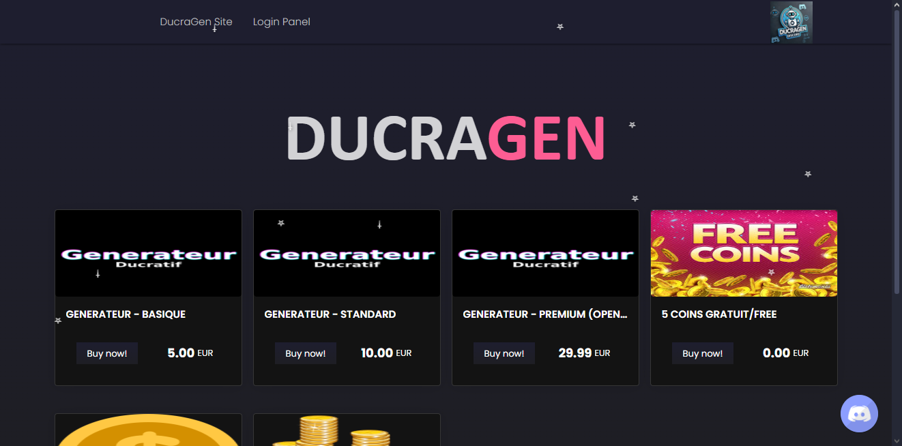
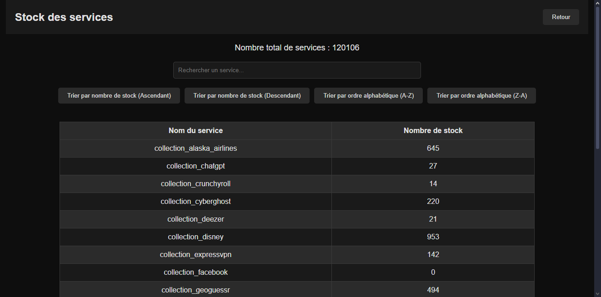

# DucraGen - Documentation d'Installation et de Configuration


DucraGen est une plateforme web permettant de generer des informations ajouter dans votre base de donnée.
Plus connu sous la fonction de générateur de compte gratuit avec une api pour une utilisation externe.
Il permet une connexion sécurisé grace a discord.
Aucune informations personnel n'est demander.

Certaine information sont crypté lors de la naviguation ainsi qu'un token est générer pour la session actuel et sera supprimer lors de la deconnexion ou bien un temps passer.

[Retrouvez toute les fonctionnalités en image en cliquant ici](#image)


---

## Table des matières

1. [Changer les informations des bases de données](#changer-les-informations-des-bases-de-données)
2. [Autorisation Discord APP](#autorisation-discord-app)
3. [Installer le panel admin](#installer-le-panel-admin)
4. [Ajouter un premier profil administrateur](#ajouter-un-premier-profil-administrateur)
5. [Redirection bouton Admin dashboard](#redirection-bouton-admin-dashboard)
6. [Configuration administrateur](#configuration-administrateur)
7. [Ajout de collections](#ajout-de-collections)
8. [Configuration de l'API](#configuration-api)
9. [Autre configuration](#autre-configuration)

---

## Changer les informations des bases de données

1. Ouvrez le fichier `config.php`.
2. Allez à la ligne 21 à 29.
3. Modifiez les informations des bases de données par les vôtres :

   - **Premier bloc** : Informations du bot et vos channels Discord.
   - **Second bloc** : Informations des ID de rôle.
   - **Troisième bloc** : ID du compte Sell.app.
   - **Quatrième bloc** : Informations sur vos bases de données SQL.

---

## Autorisation Discord APP

1. Rendez-vous sur [Discord Developer Portal](https://discord.com/developers/applications).
2. Sous la section **Redirects**, ajoutez les liens suivants :

   ```plaintext
   http://localhost/load.php
   http://localhost/index.php
   http://localhost/token_search.php
   http://localhost/dashboard.php
   
**Important :** Remplacez `http://localhost/` par votre URL réelle si vous n'êtes pas en localhost. Si vous êtes en local, vous pouvez laisser ces valeurs par défaut.

3. Modifiez également le fichier `config.php` à la ligne 5 pour définir l'URL de redirection vers votre dashboard après la connexion.

---

## Installer le panel admin

1. Vous pouvez installer le fichier **admin** à la racine de votre site ou bien créer un sous-domaine pour celui-ci.
2. Assurez-vous que tous les liens de redirection dans votre configuration sont corrects et testez le tout après installation.

---

## Ajouter un premier profil administrateur

1. Rendez-vous sur la page **register.php** pour créer un profil administrateur.
2. Un seul profil administrateur peut être créé. Si vous tentez d'en créer un autre, votre IP sera bannie du site.
3. Une fois le profil créé, **n'oubliez pas de supprimer cette page**.
4. Vous pouvez vous connecter via un **token** généré par l'API ou directement depuis la base de données (table **login_token** dans **dbs13050600**).

---

## Redirection bouton Admin dashboard

1. Ouvrez le fichier `dashboard.php` à la ligne 318.
2. Modifiez le lien de redirection vers le tableau de bord selon vos préférences.

---

## Configuration Administrateur

1. Modifiez le fichier `config.php` comme mentionné précédemment.
2. Allez dans le fichier **db_admin.php** et ajustez les informations de connexion à la base de données.

### Ajout de collections

- Lorsque vous ajoutez une collection via la page **add_collection**, elle n'est pas immédiatement publique.
- Une fois la collection ajoutée, rendez-vous sur la page **synchroniser_collection** et cliquez sur **Synchroniser** pour rendre la collection publique.

---

## Configuration API

1. Dans le dossier `adm/users`, modifiez les informations des bases de données en fonction de votre configuration.
2. Assurez-vous de ne pas modifier `DB_CHARSET`.
3. Dans le dossier `adm/config.php`, ajustez les paramètres **localhost** et **root** selon vos besoins.
4. Dans le dossier `oefzbgozebg`, modifiez également les informations de base de données.

---

## Autre Configuration

- **Documentation / Download** : Pour modifier les informations de la documentation ou du téléchargement, ajustez les paramètres dans le fichier de la base de données.
- **Shop** : Modifiez les valeurs de `data-sell-store="44060"` et `data-sell-product="222731"` pour les adapter à votre propre boutique et produit sur Sell.app.

- **data-sell-store** : ID de votre compte.
- **data-sell-product** : ID du produit que vous souhaitez afficher.

---

## Image

IMAGE MEMBRE



<br>



<br>



<br>



<br>



<br>



<br>



<br>



<br>



<br>




IMAGE ADMIN


<br>


<br>


<br>


<br>


<br>


<br>


<br>


<br>


<br>


<br>


<br>


<br>


<br>


<br>


<br>


<br>


---

## Contact

Si vous rencontrez un problème ou avez des questions, n'hésitez pas à me contacter via Discord : **Ducratif**.

---

## Site Web

Pour plus d'informations, visitez notre site web à l'adresse : [ducragen.com](https://ducragen.com).


